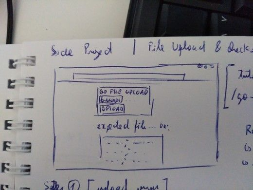

# Upload Server

### Todo
- [ ] Move configurations to Json file
#### Optional
- [ ] Create connection to mongodb
- [ ] Upsert (or clear, insert) data file to mongo
- [ ] Create Server's Docker container 
- [ ] Create Server and mongo docker-compose yaml

##### Notes
- https://tutorialedge.net/golang/go-file-upload-tutorial/
- https://gowebexamples.com/templates/