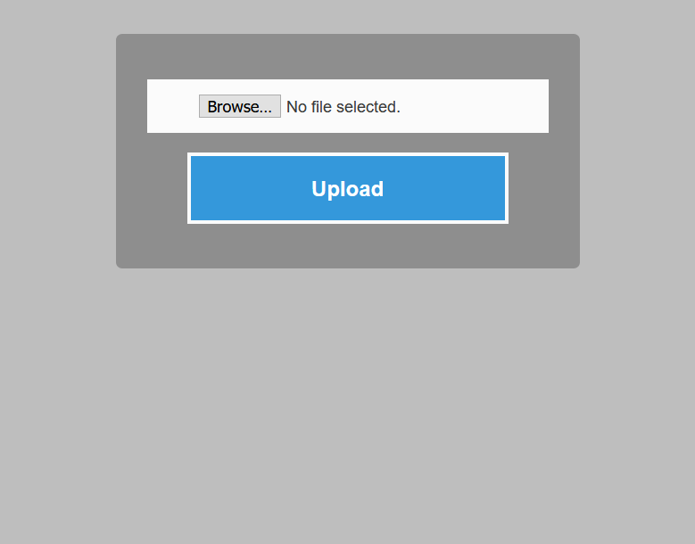
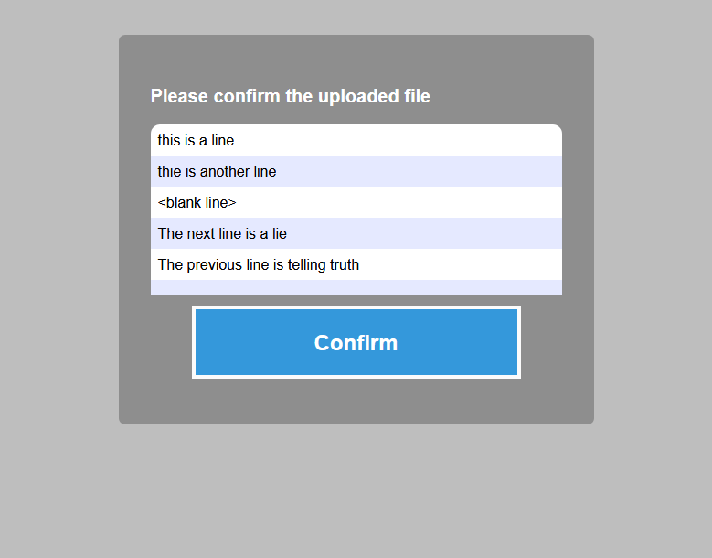
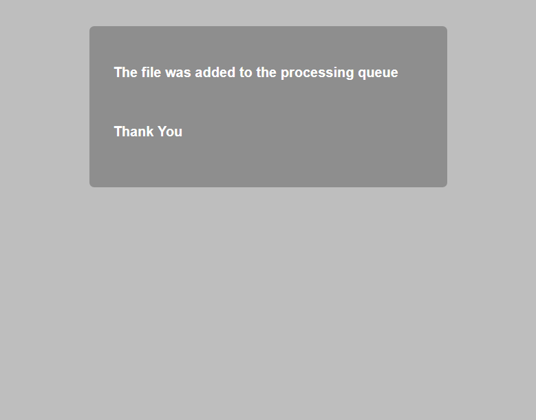

# Upload Server

### Todo
#### Optional
- [ ] Create connection to mongodb
- [ ] Upsert (or clear, insert) data file to mongo
- [ ] Create Server's Docker container 
- [ ] Create Server and mongo docker-compose yaml
